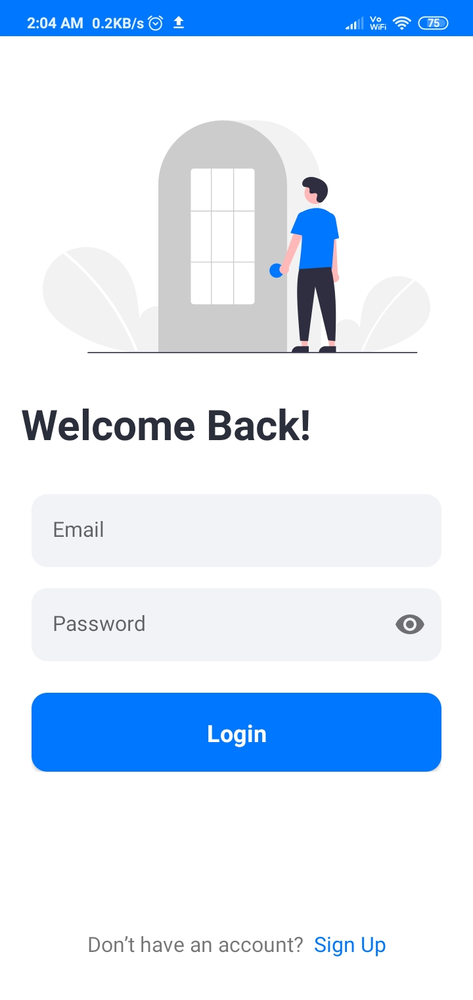
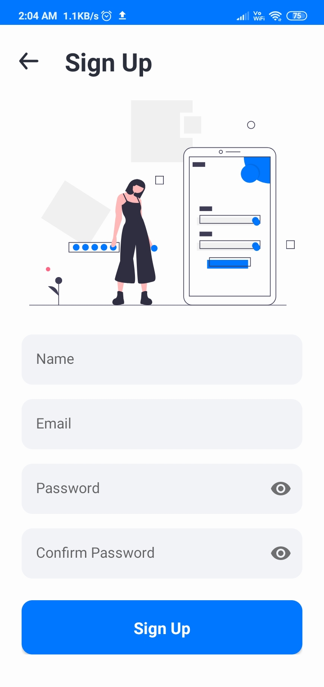
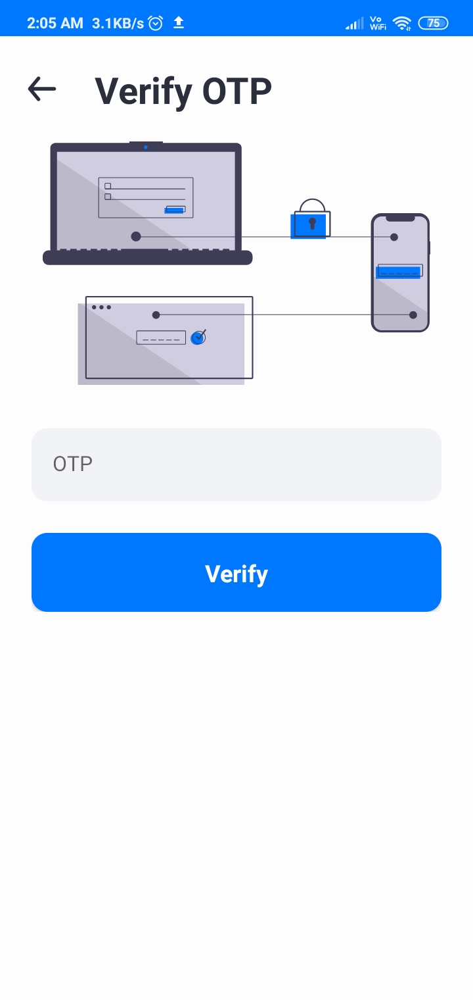
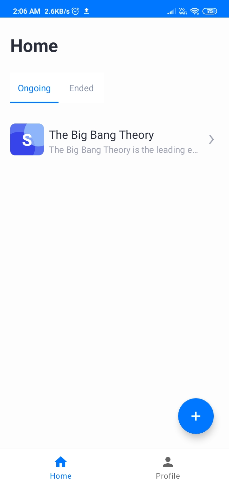
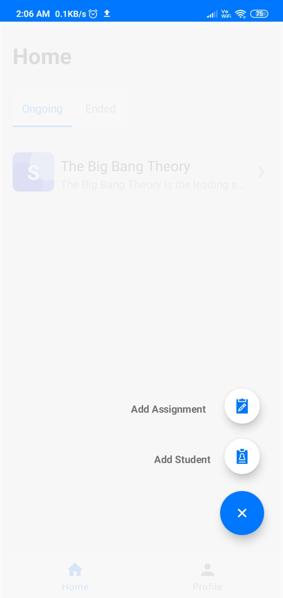
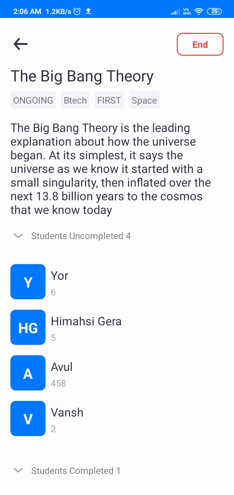
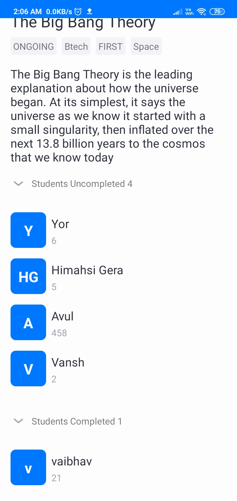
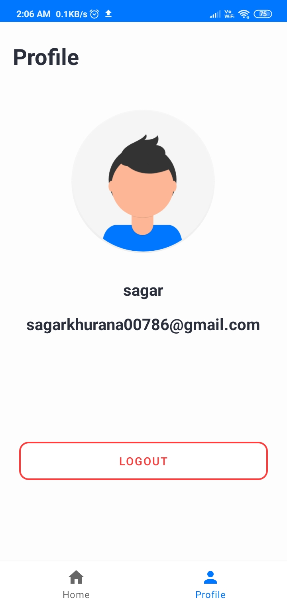

# AssigmentHub
Android application to manage assignments for teachers in college.

[](https://github.com/hellosagar/AssigmentHub/actions?query=workflow%3ABuild)
[](https://github.com/hellosagar/AssigmentHub/actions?query=workflow%3ALint)

[](LICENSE)
[](https://ktlint.github.io/)


**AssigmentHub** is a Assignment manager ✅ Android application 📱 to help teachers to mange assignments in University built to demonstrate use of *Modern Android development* tools. Dedicated to all Android Developers and *AWS Amplify* with ❤️. 

Take a look at this blog for better understanding - [link](https://hellosagar.hashnode.dev/assignmenthub-an-app-to-manage-assignments-for-university-professors-aws-amplify-hackathon)

***You can Install and test latest AssigmentHub app from below 👇***

[](https://github.com/hellosagar/AssigmentHub/releases/download/v1.2/app-release.apk)

## ⚙️ Features
* Login: Allow the teachers to login in
* SignUp: Allow the teachers to sign up
* Verify OTP: Verify the email entered by the teacher on sign up
* Home: Shows the OnGoing and the ended assignment
* Add Student: Add student in the DynamoDB database
* Add Assignment: Assign assignment to the student
* Profile: This allows the teacher to see the profile info
* Detail of Assignment: Show the detailed info about the assignment and allow the teacher to change the student assignment status

## 🚀 Technology Used

* AssignmentHub built using Kotlin
* DynamoDB as Database

## 📸 Screenshots

||||
|:----------------------------------------:|:-----------------------------------------:|:-----------------------------------------: |
|  |  |  |
|  |  |  |
|  |  |

## Built With 🛠
- [Kotlin](https://kotlinlang.org/) - First class and official programming language for Android development.
- [Android Architecture Components](https://developer.android.com/topic/libraries/architecture) - Collection of libraries that help you design robust, testable, and maintainable apps.
  - [LiveData](https://developer.android.com/topic/libraries/architecture/livedata) - Data objects that notify views when the underlying database changes.
  - [ViewModel](https://developer.android.com/topic/libraries/architecture/viewmodel) - Stores UI-related data that isn't destroyed on UI changes. 
  - [ViewBinding](https://developer.android.com/topic/libraries/view-binding) - Generates a binding class for each XML layout file present in that module and allows you to more easily write code that interacts with views.
- [Dependency Injection](https://developer.android.com/training/dependency-injection) - 
  - [Hilt-Dagger](https://dagger.dev/hilt/) - Standard library to incorporate Dagger dependency injection into an Android application.
  - [Hilt-ViewModel](https://developer.android.com/training/dependency-injection/hilt-jetpack) - DI for injecting `ViewModel`.
- [Material Components for Android](https://github.com/material-components/material-components-android) - Modular and customizable Material Design UI components for Android.
- [AWS Amplify](https://docs.amplify.aws/) - A set of tools and services that can be used together or on their own, to help front-end web and mobile developers build scalable full stack applications, powered by AWS.
- [GraphQL](https://graphql.org/) - GraphQL is an open-source data query and manipulation language for APIs, and a runtime for fulfilling queries with existing data
- [AWS AppSync](https://aws.amazon.com/appsync/) - Accelerate application development with scalable GraphQL APIs
- [Amazon DynamoDB](https://aws.amazon.com/dynamodb/) - Amazon DynamoDB is a key-value and document database that delivers single-digit millisecond performance at any scale.

# Package Structure
    
    dev.hellosagar.assigmenthub    # Root Package
    .
    ├── data                # For data handling.
    │   └── repository      # Single source of data.   
    |
    ├── di                  # Dependency Injection             
    |
    ├── ui                  # Activity/View layer
    │   ├── viewmodel       # ViewModels
    │   └── adapter         # Adpaters
    │   └── fragment        # Fragnents
    |
    └── utils               # Utility Classes / Kotlin extensions


## Architecture
This app uses [***MVVM (Model View View-Model)***](https://developer.android.com/jetpack/docs/guide#recommended-app-arch) architecture.


## Discuss 💬

Have any questions, doubts or want to present your opinions, views? You're always welcome. You can [start discussion](https://github.com/hellosagar/AssigmentHub/discussions).

## Contact
If you need any help, you can connect with me.

Visit: [hellosagarkhurana](https://www.instagram.com/hellosagarkhurana/)

## License
```
MIT License

Copyright (c) 2020 Sagar Khurana

Permission is hereby granted, free of charge, to any person obtaining a copy
of this software and associated documentation files (the "Software"), to deal
in the Software without restriction, including without limitation the rights
to use, copy, modify, merge, publish, distribute, sublicense, and/or sell
copies of the Software, and to permit persons to whom the Software is
furnished to do so, subject to the following conditions:

The above copyright notice and this permission notice shall be included in all
copies or substantial portions of the Software.

THE SOFTWARE IS PROVIDED "AS IS", WITHOUT WARRANTY OF ANY KIND, EXPRESS OR
IMPLIED, INCLUDING BUT NOT LIMITED TO THE WARRANTIES OF MERCHANTABILITY,
FITNESS FOR A PARTICULAR PURPOSE AND NONINFRINGEMENT. IN NO EVENT SHALL THE
AUTHORS OR COPYRIGHT HOLDERS BE LIABLE FOR ANY CLAIM, DAMAGES OR OTHER
LIABILITY, WHETHER IN AN ACTION OF CONTRACT, TORT OR OTHERWISE, ARISING FROM,
OUT OF OR IN CONNECTION WITH THE SOFTWARE OR THE USE OR OTHER DEALINGS IN THE
SOFTWARE.
```
